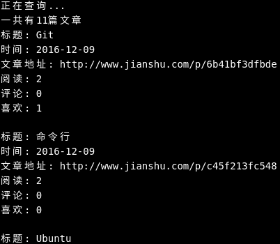

# Useage

下载zip或者clone此项目  

``` cd spider ```  

``` bundle ```  

``` ruby tw-jianshu.rb "用户名" "文章参数" ```  
比如``` ruby tw-jianshu.rb "吴立宁" "*" ```  



比如日期参数``` ruby tw-jianshu.rb "吴立宁" "2016-03-01 2016-04-01" ```  

